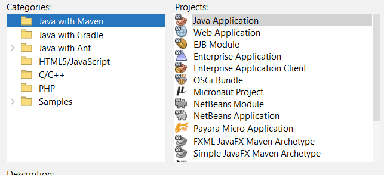

# JavaWeb101
Repositorio para aprender los fundamentos del desarrollo web con Java

---

## Roadmap

Para desarrollar páginas web dinámicas con Java necesitamos:

1. - [ ] Manejar JSP
2. - [ ] Manejar Servlets
  
Para manejo de bases de datos: 

3. - [ ] Manejar JPA

Para hacer uso de servicios web (bajo el protocolo SOAP):

4. - [ ] Manejar JAX-WS

## Glosario

**Maven:**



Maven es un gestor de dependencias. Es decir, Maven se encarga de buscar e incorporar las librerias que necesites para tus proyectos, para que tú ya no tengas que ir buscando manualmente los .jar

**JSP (Java Server Page):**

Tecnología de Java en donde en un mismo archivo se puede utilizar HTML y Java. Esto para generar contenido dinámico de manera práctica y sencilla.

**Servlet:**

Clase de Java que funciona como intermediario entre el JSP y el servidor, manejando las solicitudes y respuestas HTTP.

También se pueden generar páginas dinámicas con servlets, pero se recomienda usar JSPs para tener un workspace más ordenado.

**JAX-WS (Java API XML Web Services):**

Conjunto de APIs basados en SOAP para crear, acceder y utilizar servicios web.

**SOAP (Simple Object Access Protocol):**

Protocolo que define la comunicación entre distintos programas en la red para permitir la interoperabilidad. Está escrito en XML, lo que brinda una estructura rígida.

**javax:**

Paquete de Java con varias funcionalidades y tecnologías, desde GUI (Interfaz Gráfica de Usuario) hasta acceso a bases de datos, seguridad, comunicaciones, XML y más.

En versiones más recientes, se cambió el nombre de javax a jakarta.

**JPA (Java Persistence API):**

Tecnología Java que permite el mapeo relacional de objetos, es decir, te permite convertir las tablas de base de datos a clases java y clases java a tablas.

Existen varios gestores de JPA. Entre los más comunes se encuentran: *Hibernate* y *Eclipselink*

## JSP
<font color="red"> **Importante!:** </font> Al parecer *Jakarta 10* no cuenta con autocompletado ni sugerencias a la hora de escribir código Java en los archivos JSP en NetBeans. Yo opté por usar *Jakarta 8* (por alguna razón no esta la 9) con *Tomcat 9*.

## Servlet

Recordar que el protocolo HTTP maneja los métodos GET y POST.

### doGet()

Es importante obtener la sesión:

```java
HttpSession miSesion = request.getSession();
        miSesion.setAttribute("listaUsuarios", listaUsuarios);
```

(donde listaUsuarios es una variable tipo lista de la clase Usuarios, por lo que después en el JSP será necesario hacer un casting)

---

También importante marcar dónde se va a redirigir:

```java
response.sendRedirect("mostrarLista.jsp");
```

### doPost()

Se suele usar el método `request.getParameter("nombre-del-parametro")` para obtener los datos del JSP

## JPA

Para lograr el mapeo correcto, nos apoyamos de las etiquetas de Java

## Configuarción

### porm.xml (~)

Contiene la versión de `maven-war-plugin`. En caso de error, borrar la versión que tiene y darle a <font color="cyan">*ctrl + espacio* </font> para obtener la versión más reciente.

## Recursos

- **Aprender a manejar JSP, Servlets y JPA**

    [Lista de Reproducción de YouTube](https://www.youtube.com/watch?v=dm0stmK5egM&list=PLQxX2eiEaqbzhvlMJZkyFoZpyo33T6rm7&pp=iAQB)

- **Aprender a manejar JAX-WS**
 
    [Lista de Reproducción de YouTube]() (Próximamente)
